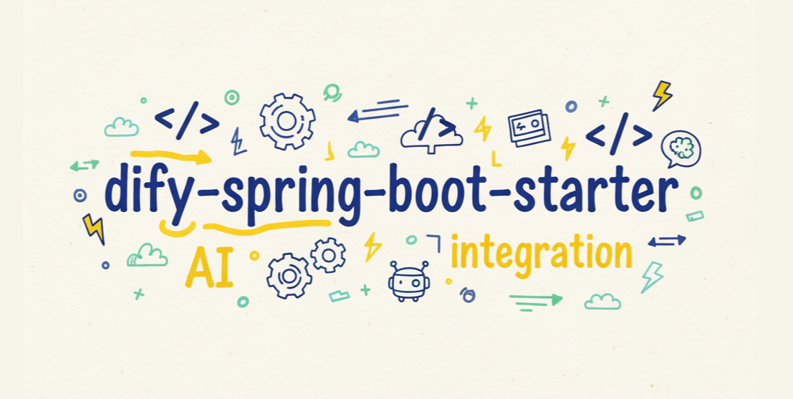

## dify-spring-boot-starter

## 

<p align="center">
  <a href="https://guoshiqiufeng.github.io/dify-spring-boot-starter/">文档</a> ·
  <a href="https://github.com/guoshiqiufeng/dify-spring-boot-starter-examples">示例</a> ·
  <a href="https://deepwiki.com/guoshiqiufeng/dify-spring-boot-starter">DeepWiki</a>
</p>

<div align="center">

[](https://search.maven.org/search?q=g:io.github.guoshiqiufeng.dify%20AND%20a:dify-spring-boot-starter)
[](http://www.apache.org/licenses/LICENSE-2.0.html)
[](https://github.com/guoshiqiufeng/dify-spring-boot-starter/actions/workflows/github-code-scanning/codeql)
[](https://codecov.io/gh/guoshiqiufeng/dify-spring-boot-starter)

</div>

阅读其他语言版本: [English](README.md)

**🎉 2.0 版本重大更新**: 模块化架构重构，支持纯 Java 项目！查看 [变更记录](CHANGELOG-2.0-zh.md)

### 介绍

为 Dify 提供 Spring Boot Starter 和纯 Java 支持，简化开发。

**2.0 版本新特性**:
- ✨ 支持纯 Java 项目（无需 Spring）
- 🔧 模块化架构，灵活的 HTTP 客户端
- 📦 多种 JSON 编解码器选项（Gson、Jackson 2.x/3.x）
- 🚀 统一的客户端实现，消除代码重复
- 🔒 日志脱敏与 SSE 安全加固（v2.1.0+）

### 支持的框架

- Spring Boot 4/3/2
- 纯 Java 项目（2.0+）

### 最低版本要求

- Java 8
- Spring Boot 2（Spring 项目）

### 推荐版本

- Java 17+
- Spring Boot 4/3

### 功能

- 聊天 (Chat)
- 后台 (Server)
- 工作流 (Workflow)
- 知识库 (Dataset)
- 状态监控 (Status)
- 日志安全（脱敏与 SSE 保护）

### 使用

#### Maven 镜像仓库

- 国内用户建议使用腾讯镜像仓库，腾讯会自动同步：`https://mirrors.cloud.tencent.com/nexus/repository/maven-public`
- 不建议使用阿里云 Maven 镜像仓库，同步比较慢

#### 引入 BOM 统一版本管理

```xml
<dependencyManagement>
    <dependencies>
        <dependency>
            <groupId>io.github.guoshiqiufeng.dify</groupId>
            <artifactId>dify-bom</artifactId>
            <version>2.2.0</version>
            <type>pom</type>
            <scope>import</scope>
        </dependency>
    </dependencies>
</dependencyManagement>
```

#### 引入 Starter 依赖

**Spring Boot 3.1+**

```xml
<dependency>
    <groupId>io.github.guoshiqiufeng.dify</groupId>
    <artifactId>dify-spring-boot-starter</artifactId>
</dependency>
```

**Spring Boot 4.x**

> dify-spring-boot-starter v1.6.0+ 可用

```xml
<dependency>
    <groupId>io.github.guoshiqiufeng.dify</groupId>
    <artifactId>dify-spring-boot4-starter</artifactId>
</dependency>
```

**Spring Boot 2.x / 3.0.x**

> dify-spring-boot-starter v0.9.0+ 可用

```xml
<dependency>
    <groupId>io.github.guoshiqiufeng.dify</groupId>
    <artifactId>dify-spring-boot2-starter</artifactId>
</dependency>
```

**纯 Java 项目**

> dify-spring-boot-starter v2.0.0+ 可用

```xml
<dependency>
    <groupId>io.github.guoshiqiufeng.dify</groupId>
    <artifactId>dify-java-starter</artifactId>
</dependency>
```

#### Spring Boot 自动配置

##### YAML 配置

```yaml
dify:
  url: http://192.168.1.10 # Dify 服务地址
  server:
    email: admin@admin.com # Dify 服务邮箱（调用 Server API 时需要）
    password: admin123456 # Dify 服务密码（调用 Server API 时需要）
    password-encryption: false # 密码加密开关，默认 true
                                # Dify 1.11.2+ 需要开启（或使用 Base64 密文）
                                # Dify 1.11.2 以下版本设置为 false
  dataset:
    api-key: dataset-aaabbbcccdddeeefffggghhh # 知识库 API Key（调用 Dataset API 时需要）
```

##### 使用示例

```java
@Service
public class DifyChatService {

    @Resource
    private DifyChat difyChat;

    public List<String> messagesSuggested(String messageId, String apiKey, String userId) {
        return difyChat.messagesSuggested(messageId, apiKey, userId);
    }
}
```

#### 手动构建客户端（Builder 模式）

> dify-spring-boot-starter v2.0.0+ 可用

**纯 Java 项目**:

```java
import io.github.guoshiqiufeng.dify.client.integration.okhttp.http.JavaHttpClientFactory;
import io.github.guoshiqiufeng.dify.client.codec.jackson.JacksonJsonMapper;
import io.github.guoshiqiufeng.dify.support.impl.builder.DifyServerBuilder;
import io.github.guoshiqiufeng.dify.core.config.DifyProperties;

// 创建 HTTP 客户端工厂（OkHttp）
JavaHttpClientFactory httpClientFactory = new JavaHttpClientFactory(new JacksonJsonMapper());

// 创建客户端配置
DifyProperties.ClientConfig clientConfig = new DifyProperties.ClientConfig();
// 设置其他配置...

// 创建 DifyServerClient
DifyServerClient difyServerClient = DifyServerBuilder.builder()
        .baseUrl("https://your-dify-api.example.com")
        .httpClientFactory(httpClientFactory)
        .clientConfig(clientConfig)
        .serverProperties(new DifyProperties.Server("admin@example.com", "password"))
        .build();

// 创建 DifyServer
DifyServer difyServer = DifyServerBuilder.create(difyServerClient);
```

**Spring 项目**:

```java
import io.github.guoshiqiufeng.dify.client.integration.spring.http.SpringHttpClientFactory;
import io.github.guoshiqiufeng.dify.client.codec.jackson.JacksonJsonMapper;
import io.github.guoshiqiufeng.dify.support.impl.builder.DifyServerBuilder;
import org.springframework.web.reactive.function.client.WebClient;
import org.springframework.web.client.RestClient;

// 创建 HTTP 客户端工厂（Spring）
SpringHttpClientFactory httpClientFactory = new SpringHttpClientFactory(
        WebClient.builder(),
        RestClient.builder(),  // Spring 6.1+ / Spring Boot 3.2+
        new JacksonJsonMapper()
);

// 创建客户端配置
DifyProperties.ClientConfig clientConfig = new DifyProperties.ClientConfig();
// 设置其他配置...

// 创建 DifyServerClient
DifyServerClient difyServerClient = DifyServerBuilder.builder()
        .baseUrl("https://your-dify-api.example.com")
        .httpClientFactory(httpClientFactory)
        .clientConfig(clientConfig)
        .serverProperties(new DifyProperties.Server("admin@example.com", "password"))
        .build();

// 创建 DifyServer
DifyServer difyServer = DifyServerBuilder.create(difyServerClient);
```

> **注意**: Spring Boot 2.x 环境下，RestClient 不可用，传入 `null` 即可。

更多使用参考查看

- [文档](https://guoshiqiufeng.github.io/dify-spring-boot-starter)
- [examples](https://github.com/guoshiqiufeng/dify-spring-boot-starter-examples)

## Star History

[](https://www.star-history.com/#guoshiqiufeng/dify-spring-boot-starter&Date)


